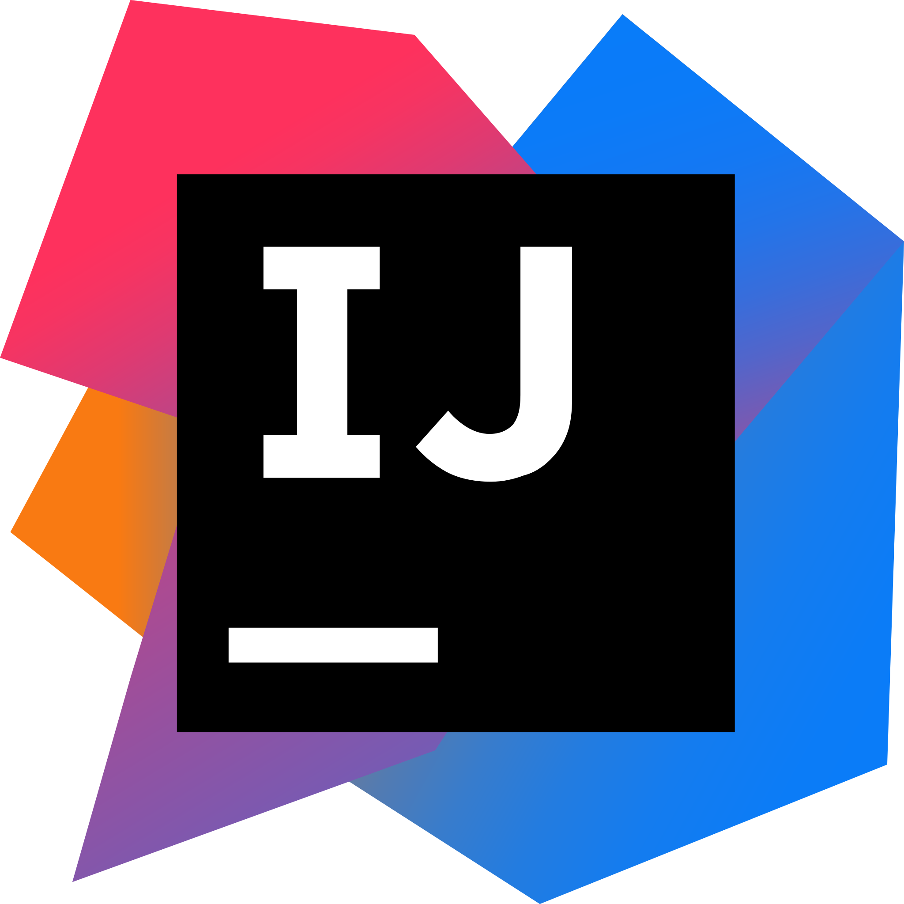

<h1 align="center">🎞️ MoonVs</h1>

Catálogo e recomendação de filmes e séries

    <a href="#🗣️-idiomas">Idiomas</a> • 
    <a href="#🎯-status-do-projeto">Status</a> • 
    <a href="#⚙️-funcionalidades">Funcionalidades</a> • 
    <a href="#📲-demonstração-da-aplicação">Demonstração da Aplicação</a> • 
    <a href="#📜-pré-requisitos">Pré-Requisitos</a> • 
    <a href="#🚀-rodando-o-projeto">Rodando o Projeto</a> • 
    <a href="#🛠️-ferramentas">Ferramentas</a> •
    <a href="#👨‍💻-autor">Autor</a>

## 🗣️ Idiomas

## 🎯 Status do Projeto
🚧 Em Desenvolvimento 🚧

## ⚙️ Funcionalidades
- [X] Cadastro e autenticação de usuários
- [X] Pesquisa de filmes e séries
- [X] Visualização de informações completas sobre filmes e séries
- [ ] Avaliação e comentários de filmes e séries
- [ ] Criação de listas, e inserção de títulos as listas
- [ ] Recomendação baseada nos filmes e séries assistidos anteriormente

## 📲 Demonstração da Aplicação
Imagens, links, informações...

## 🚀 Rodando o Projeto
 

Para usar a aplicação é necessário registrar e autenticar, é possível também autenticar com o usuário já existente, o qual está preenchido no endpoint 'Login'.

Após a autenticação, é ncessário copiar o token exibido na resposta, e colar no campo 'Token' na coleção MoonVs na aba 'Autorização'.

A partir disso, é possível acessar todos os endpoints existentes, para testá-los é necessário apenas completar os campos vazios.

<b>A primeira requisição, pode levar um tempo mais longo, considerando que está sendo usado um plano de hospedagem gratuito.</b>

## 🛠️ Ferramentas
<ul style="list-style:none">
    <li> <a href="https://www.java.com/pt-BR/">Java 19</a></li>
    <li> <a href="https://spring.io/">Spring Framework</a></li>
    <li> <a href="https://www.postgresql.org/">PostgreSQL 16</a></li>
    <li> <a href="https://www.jetbrains.com/pt-br/idea/">IntelliJ Idea</a></li>
    

    <li> <a href="https://render.com/" target="_blank">Render</a></li>
    <li> <a href="https://aiven.io/" target="_blank">Aiven</a></li>
</ul>

## 👨‍💻 Autor
<table>
    <tr>
        <td align="center">
            <a href="http://github.com/luanpozzobon">
             
            
                <b>luanpozzobon</b>
            
            </a>
        </td>
    </tr>
</table>
