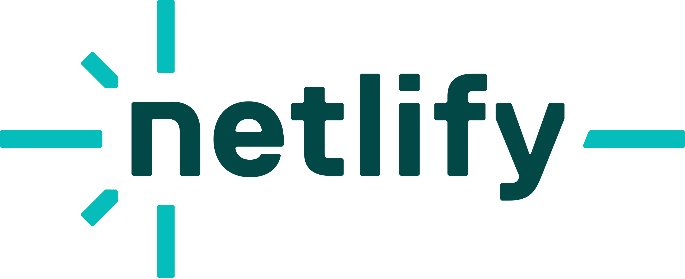

<picture>
  <source media="(prefers-color-scheme: dark)" srcset="./assets/logos/Logo-Black.png">
  
</picture>

Uma aplicação web, que utiliza da API do TMDB, é possível buscar e acessar informações sobre muitos filmes e séries. No futuro será possível também, criar listas para agrupar conteúdos, avaliá-los, e adicionar os conteúdos em uma lista à assistir, permitindo rastrear filmes e séries a assistir, e àqueles já assistidos.

## 🗣️ Idiomas

## ⚙️ Funcionalidades
- [X] Cadastro e autenticação de usuários
- [X] Pesquisa de filmes e séries
- [X] Visualização de informações completas sobre filmes e séries
- [x] Avaliação e comentários de filmes e séries
- [X] Criação de listas, e inserção de títulos as listas
- [ ] Recomendação baseada nos filmes e séries assistidos anteriormente

## 🚀 Access the Project
Você pode acessar o projeto e usar todas as funções, acessando a [página do projeto](https://moonvs.netlify.app/). 
Você também pode ver mais informações sobre, como o changelog, ou informações sobre o desenvolvimento, entrando na [página Sobre](https://luanpozzobon.github.io/luanpozzobon_site/pages/projects/moonvs/moonvs.html).

## 🛠️ Ferramentas
<ul style="list-style:none">
    <li> <a href="https://www.java.com/pt-BR/">Java 19</a></li>
    <li> <a href="https://spring.io/">Spring Framework</a></li>
    <li> <a href="https://www.postgresql.org/">PostgreSQL 16</a></li>
    <li> <a href="https://www.jetbrains.com/pt-br/idea/">IntelliJ Idea</a></li>
    

    <li> <a href="https://fly.io/" target="_blank">Fly.io</a></li>
    <li> <a href="https://aiven.io/" target="_blank">Aiven</a></li>
    <li> <a href="https://www.netlify.com/" target="_blank">Netlify</a></li>
</ul>

## 👨‍💻 Autor
<table>
    <tr>
        <td align="center">
            <a href="http://github.com/luanpozzobon">
             
            
                <b>luanpozzobon</b>
            
            </a>
        </td>
    </tr>
</table>
